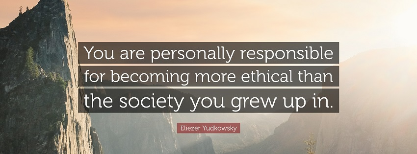

Hi, I am Nathan.
This is a new thing for me. Sharing my thoughts, that is.

# A Little About Me

I was born and raised in central MN, and despite it's temperamental weather, I do love it here.
I am married with 2 kids, and they are the center of my life. They have been the greatest influence on shaping who I am, as well as who I strive to be.

Some things I enjoy are: 
- Listening to and playing music (guitar, piano, digital)
- Playing and [streaming](twitch.tv/wardofdonblade) various video games (primarily with my lovely Discord pals)
- Coffee, beer, tea (pretty much any good beverage)
- Apparently bullet point lists and parentheticals 

<!-- end -->

# Expectations

I don't know what I expect out of this, to be honest. At this point, I don't even know what the content will look like.

That said, there are things that I know this will not be:
- I don't consider myself to be an expert in anything. I certainly am not out here to give advice or present myself like I am coming from a place of any authority. 
- I am not here to debate. I _know_ that we will definitely not agree on everything, but I am not looking for feedback or to engage in arguments. 
- This is not going to be regularly scheduled content. It is not going to be performative or even really for entertainment.

Right now, I think this is an exercise for me in a few areas. A kind of therapy, if you will.

## Finding Value In My Voice

Most people are pretty surprised when they learn I am an extrovert. 
Externally, I have every indication of being an introvert, but that is just not who I am.

What predominantly gives this impression is that I don't talk much, especially when first meeting people or when I am around people that I am uncomfortable with. 

I deal with a pretty significant lack of self confidence, which can be evidenced by earlier statements in this post. 
To be honest, I didn't have a strong sense of who I was until at least my 20s. I grew up being a follower. I pretty much went along with the crowds that I was in at a given time.

The biggest impact of change for me was when my oldest son was born. How could I teach and raise this child to be a good human if I am still bad at it myself?
This was the turning point for me to both figure out what values define me and how I can live in a way that actually displays those values.
The obvious first big step of that is talking. Sharing my thoughts and opinions.

_This still terrifies me. Constantly._

I had gone nearly over two decades mentally devaluing my own voice because I felt that I didn't have much of anything to contribute, that I would be wrong, or people wouldn't like me because of what I had to say.
To be clear, I did not feel this about the people that I was closest to. My immediate or other close family as I was growing up, and Allison since we got together... but in pretty much every other setting, it was a different story, which leads to my second point.

## Worrying Less About Judgement 

I have always had the fear that if I voice my opinions that I would be judged, ridiculed, lose friends, etc.
The worry that I would say something and be wrong about it terrified me, so I would often just go without saying anything. 

I am starting to realize as I have made strides in valuing my voice more and being confident in my values and opinions that instead of focusing on I might _lose_ from sharing those things, I should be focusing on what I might _gain_. 
As I have been sharing more, friendships have been strengthened, I have learned a ton, and I am working through a lot of these social anxieties that I have dealt with for as long as I can remember.

Although I have made progress, the fear of judgement is something I have far from overcome, but I feel this muscle flexing as I have made the small steps of learning that my voice matters. 

## Supporting Others

The last 5 years in particular have been wildly eye opening to me. 
When former president Cheeto Baby took office, I was shocked to say the least. At that point, my social and political awareness skyrocketed. 
I will have plenty more to say on this over time, but at this point, I'll just say this: 

I will do my best and work my hardest to stand with marginalized communities.
Every life deserves value, to be respected, to be seen, and to be treated equally.
I am committed to listening to and amplifying their voices and will use whatever platforms that I have to do so.

# Going Forward

My only goal from this is to make active steps in these 3 areas. 
I don't know how that looks or plays out over the course of posting here.

All I know at this point is that I will be doing my best to continually improve.
Listening, reading, researching, conversing, practicing. 
All I can do is keep moving forward and try to be a better person along the way.

I will leave you with a quote from Eliezer Yukowsky (the co-founder of the Machine Intelligence Research Institute) that has stuck with me since I heard it:

